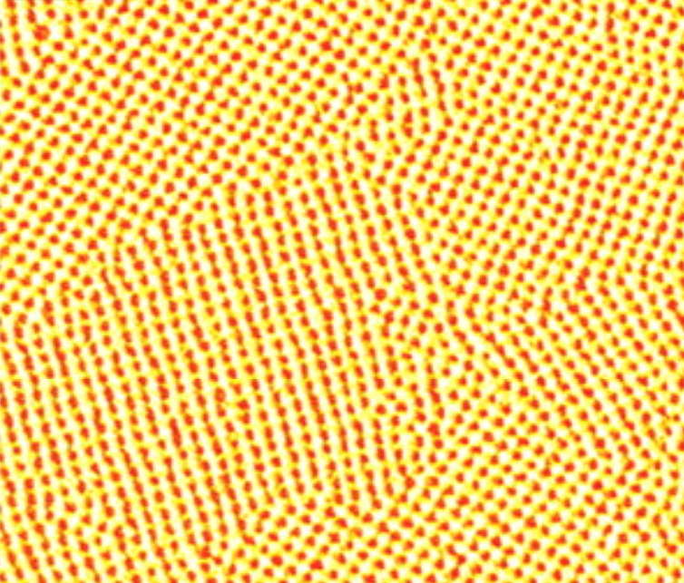

# Example 3 - Local Pattern Orientation

See [here](https://github.com/uw-comphys/shapelets/tree/main/examples/example_3) for files and code related to this example. 

This example demonstrates the local pattern orientation method ([M.P. Tino (2024)](http://dx.doi.org/10.1088/1361-6528/ad1df4)) implemented in ``shapelets.self_assembly.apps.orientation`` for a square self-assembled nanostructure image ([C. Tang (2008)](https://doi.org/10.1126/science.1162950))

## Overview

Local pattern orientation is concerned with relative nanostructure orientation along grain boundaries and between grains. 
The details of this method can be found [here](http://dx.doi.org/10.1088/1361-6528/ad1df4). 

It is also important to note that this method is only applicable to images with **one** dominant pattern type. 
Images with mixed patterns are not allowed.

## Configuration File

### Setup

The example [config](https://github.com/uw-comphys/shapelets/tree/main/examples/example_3) contains the following:

	[general]
	image_name = sqrAFM2.png
	method = orientation

	[orientation]
	pattern_order = square

where **image_name** and **method** are required parameters that specify the image filename and method used for analysis, respectively.

The **orientation** method requires one parameter.

**pattern_order** `str` (required)

* The pattern order (symmetry) observed in the image.
* Example values: `stripe`, `square`, `hexagonal`

## Run Example

Ensure `shapelets` is installed before proceeding.
See [here](https://uw-comphys.github.io/shapelets/shapelets/docs/install.html) for installation instructions.

This example assumes the working directory has a sub-directory ``analysis`` containing the necessary files: ``analysis/config`` and ``analysis/images/sqrAFM2.png``. 

To run the example, execute ``shapelets-run ./analysis/config`` in the command line.
Depending on your computer hardware, the iterative convergence scheme may take a couple of minutes.

The output (shown below) will then be available in ``./analysis/output`` containing the mask (top left), dilated feature orientation (top right), smoothed orientation result, and the smoothed orientation result superimposed onto the original pattern (shown below, respectively).

## Additional Notes

For users who do not wish to use configuration files and would prefer to interact with shapelets via standard python programming, please see the ``example_3.py`` script [here](https://github.com/uw-comphys/shapelets/tree/main/examples/example_3).
You can use this script as a template to conduct your own analyses.