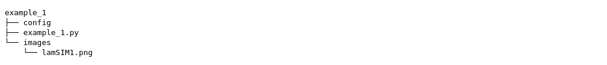
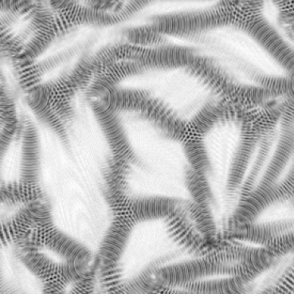
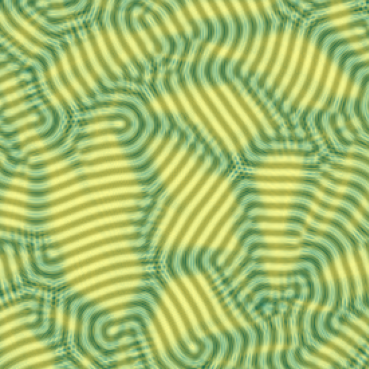

.. Contains the first example.
.. _example_1:

Example 1 - Response Distance Method
====================================

This example goes through the process of computing the response distance method from `Suderman et al. (2015) <https://doi.org/10.1103/PhysRevE.91.033307>`_ for self-assembly microscopy images using :code:`shapelets.self_assembly`.

The files for this example can be found in "shapelets/examples/example_1".

**NOTE** - this example can be run in two different ways, and both methods are presented here.
* (1) the configuration-file based user interface (config method)
* (2) importing neccessary :code:`shapelets` submodules in a script-based format (scripting method)

Technical overview
------------------

The response distance (`Suderman et al. (2015) <https://doi.org/10.1103/PhysRevE.91.033307>`_) is calculated as:

.. math::
    d_{i, j} = \min \| \vec{R} - \vec{r_{i,j}} \|_2

where :math:`\vec{r_{i,j}}` denotes the given response vector at pixel location :math:`{i, j}` and :math:`\vec{R}` is the reference set (or subdomain) of response vectors.

Directory overview
------------------

The directory in "shapelets/examples/example_1" should contain the following.

* **config** contains the configuration file to run example 1 via config method
* **example_1.py** contains the script to run example 1 via scripting method
* **images/** contains the image used in this example, shown below

.. image:: ../../examples/example_1/images/lamSIM1.png
	:width: 90%
	:align: center
	:alt: Simulated stripe self-assembly microscopy image from ref. `Suderman et al. (2015) <https://doi.org/10.1103/PhysRevE.91.033307>`_

Method parameters
-----------------

The parameters for the response distance method are outlined below.

Note these parameters are the same if using the configuration-file based method (config) or the scripting method (example_1.py). 

These parameters are explained below, note that *default* refers to default behaviour if the parameter is excluded.

* **shapelet_order** 

	* int - integer, compute convolution for maximum shapelet order :math:`m'`, i.e. :math:`m = [1, m']`
	* default = :math:`m'` (higher-order shapelets), see REFTINO for details

* **num_clusters**

	* int - integer (including 0, which will not perform k-means clustering and use all response vectors in subdomain)
	* default = 20

* **ux**

	* list - I.e., [10, 20], this would represent the lower and upper bound for the user-defined subdomain in x-direction respectively
	* default = user select x-bounds during runtime, see "Selecting subdomain bounds during runtime" below

* **uy** 

	* list - I.e., [30, 40], this would represent the lower and upper bound for the user-defined subdomain in y-direction respectively
	* default = user select y-bounds during runtime, see "Selecting subdomain bounds during runtime" below

**NOTE**

* You may only exclude parameters that have defaults (in this case, all 4 parameters have defaults)
* If you do not know the subdomain bounds (**ux** and **uy**), please see the section below "Selecting subdomain bounds during runtime"

Config method - config setup
----------------------------

The *general* section of the configuration file contains two parameters. 

	[general]
	image_name = lamSIM1.png
	method = response_distance

The "image_name" and "method" parameters are required.

Here the "method" parameter is chosen to be "response_distance" to indicate computation of the response distance method from ref. `Suderman et al. (2015) <https://doi.org/10.1103/PhysRevE.91.033307>`_.  

The *response_distance* section of the configuration file contains four parameters. 

	[response_distance]
	shapelet_order = default
	num_clusters = 20
	ux = [50, 80]
	uy = [150, 180]
		
These parameters are explained in detail in the above section "Method parameters".

Config method - running config
------------------------------

This config file is setup to compute the response distance for images/lamSIM1.png with a user-defined subdomain already given in the config.

Navigate your terminal to "shapelets/examples/example_1". 

When you are ready, type :code:`shapelets config`.

The output (shown below) will be available in "shapelets/examples/example_1/output" containing the response distance scalar field as well as this field superimposed onto the original pattern.

Scripting method - example_1.py breakdown
-----------------------------------------

This method is presented as an alternative to the configuration-file based user interface (config method).

**example_1.py** is pre-configured and requires **no additional modifications**.

The code breakdown is as follows,

* Section 1: importing modules - imports the necessary modules from the :code:`shapelets` package
* Section 2: parameters - this contains the required parameters needed for the methods required to compute the response distance method (see above section "Method parameters" for details)
* Section 3: code - this contains the code to compute the response distance method which involves the following steps:

	* 3.1: image and output directory handling
	* 3.2: get the characteristic wavelength of the pattern
	* 3.3: get the convolutional response 
	* 3.4: compute the response distance 
	* 3.5: processing and saving the results to the **output/** directory 

Scripting method - executing example_1.py
-----------------------------------------

Navigate your terminal to "shapelets/examples/example_1". 

When you are ready, type :code:`python3 -m example_1` (for MAC OS and LINUX users).

For WINDOWS users, please replace 'python3' with 'python'.

The output will be available in "shapelets/examples/example_1/output".

For an example of the output expected, see the config method section above "Config method - running config".

Selecting subdomain bounds during runtime
-----------------------------------------

If you are computing the response distance method for the first time on a new image, you will typically not know the reference subdomain bounds (i.e., parameters **ux** and **uy**) a priori. 

Adjustments required:

* config method - simply remove the **ux** and **uy** parameters
* scripting method - comment out the **ux** and **uy** statements in **example_1.py**

Follow the same steps for the config or scripting method, depending on your preference.

**Selecting bounds during runtime:**

After performing :code:`shapelets config` (config method) or :code:`python3 -m example_1` (scripting method), you will immediately be prompted to select four (4) points that represent the four corners/bounds of the reference subdomain

* use "a" to select a corner (bound) (in no particular order), 
* "backspace/delete" to remove the most recently selected corner, and 
* "enter" when you have finished selecting 4 points/corners 

**NOTE** 

* You may use the **magnifying glass** (bottom left) to zoom in on a specific region
* You may use the **left arrow** (bottom left) to return to original zoom
* Failure to choose 4 points/corners (i.e., choosing less or more than 4) will restart the process automatically
* It is critical to choose a region of the pattern that is appears to contain zero observable defects to maximize the response distance results
