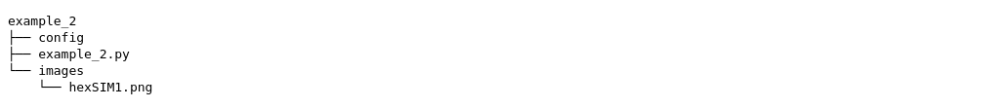
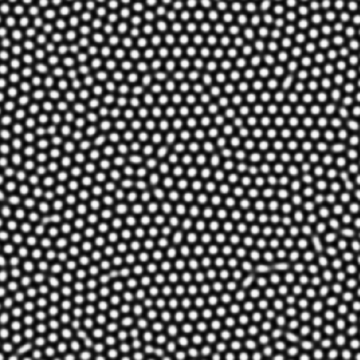
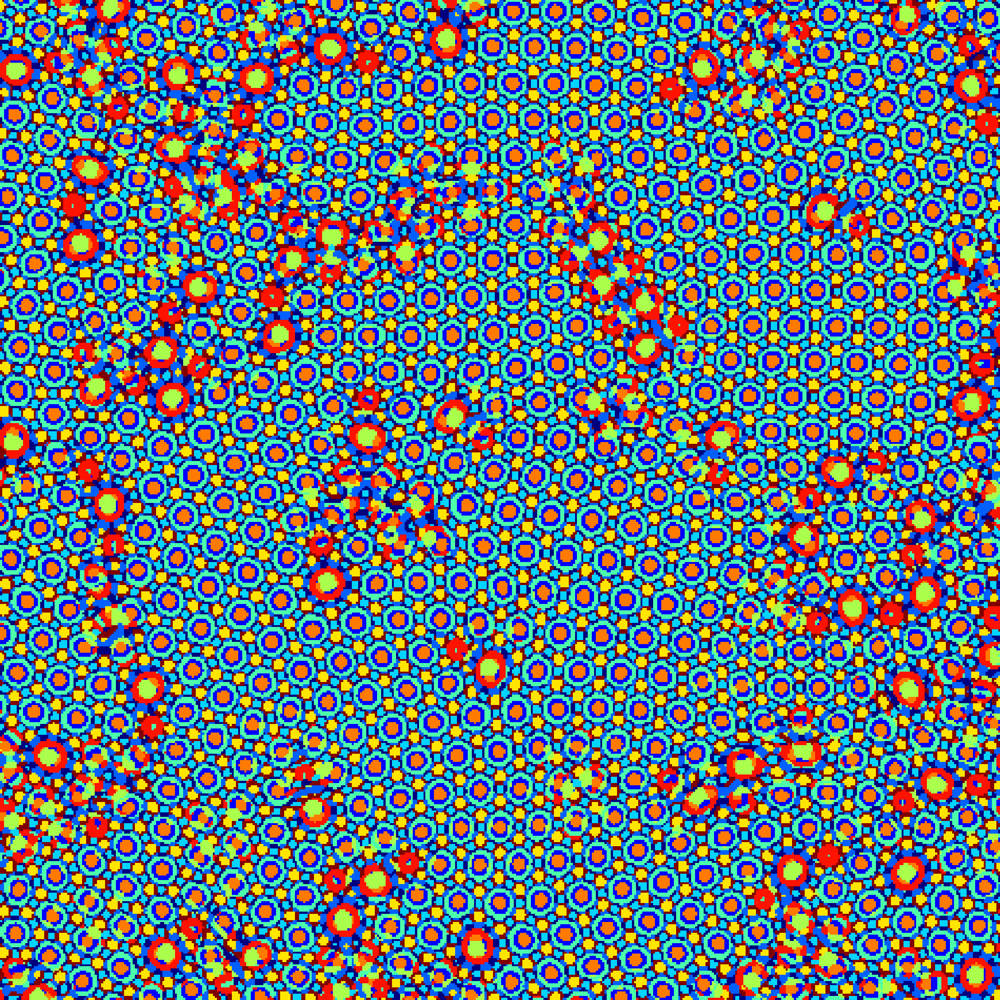
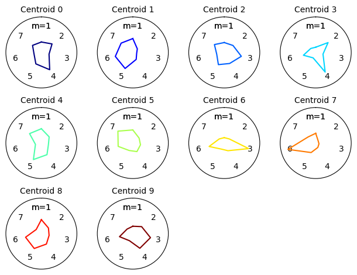
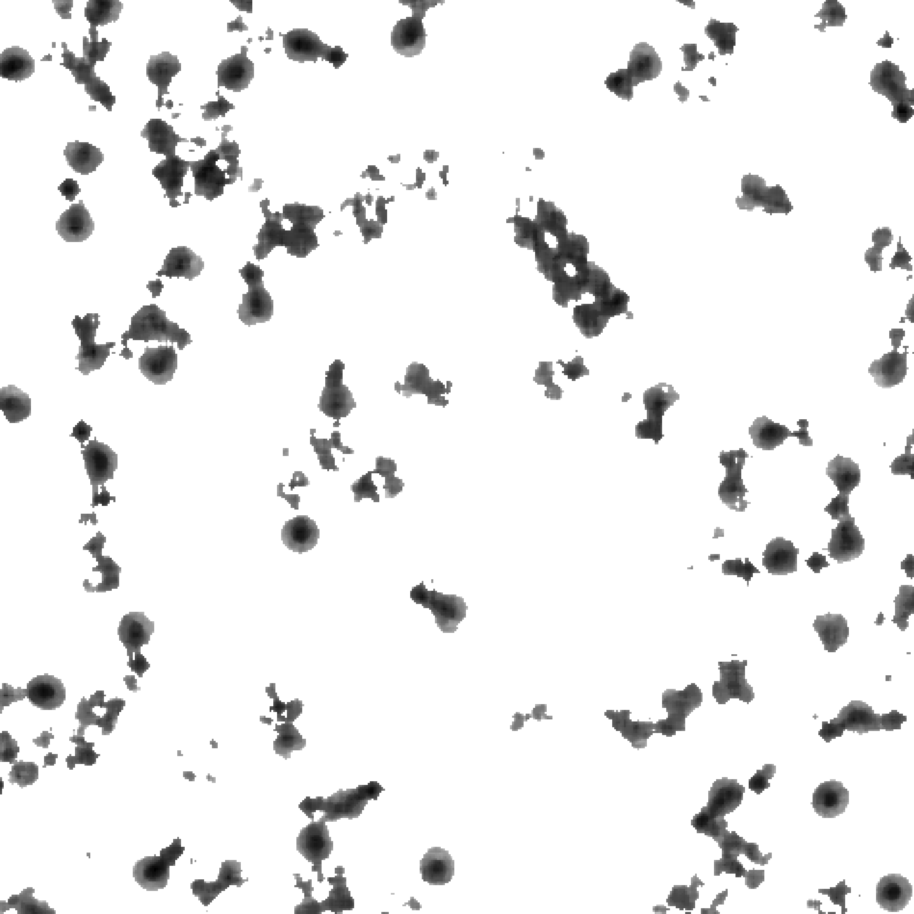
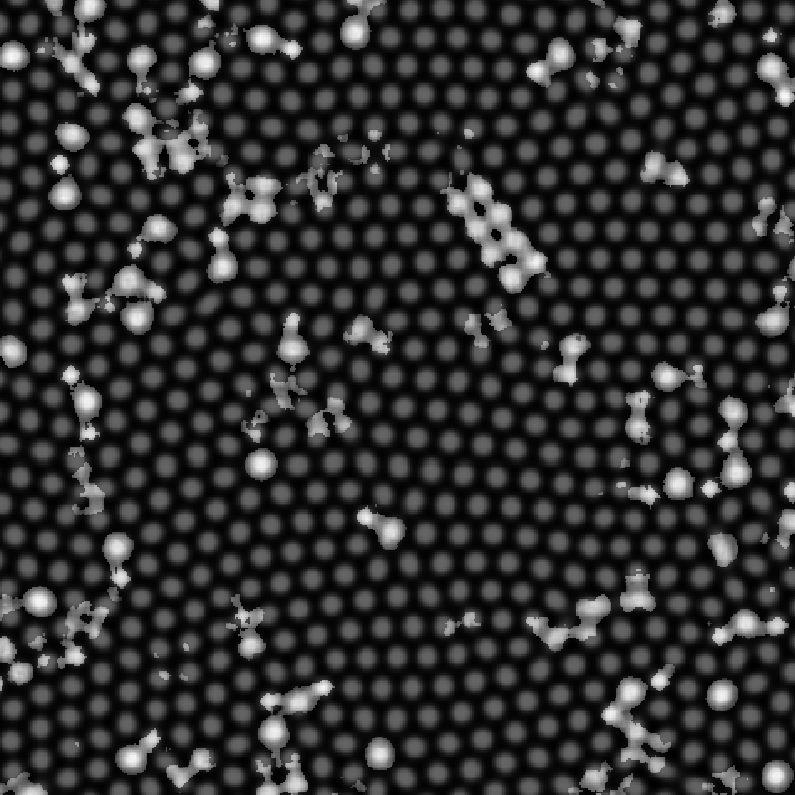

.. Contains the second example.
.. _example_2:

Example 2 - Defect Identification Method
========================================

This example goes through the process of computing the defect identification method from ref. REFTINO for self-assembly microscopy images using :code:`shapelets.self_assembly`. 

The files for this example can be found in "shapelets/examples/example_2".

**NOTE** - this example can be run in two different ways, and both methods are presented here.
* (1) the configuration-file based user interface (config method)
* (2) importing neccessary :code:`shapelets` submodules in a script-based format (scripting method)

Technical overview
------------------

The defect identification method (REFTINO) is a modification from the response distance method from ref. `Suderman et al. (2015) <https://doi.org/10.1103/PhysRevE.91.033307>`_. 

The user is required to manually select the clusters associated with defects or defect structures, and the *defect response distance* is computed for each cluster. 

The *defect response distance* is similar to the response distance, but the reference subdomain is the centroid response vector of each cluster (and not a set of reference response vectors). 

I.e., for a given cluster :math:`C` with centroid :math:`C_c`, the defect response distance is computed as:

.. math::
	d_i = \| C_c - c_i \|_2

where :math:`c_i` is a cluster response vector belonging to cluster :math:`C` and is computed for all response vectors in each cluster.

The key observation is that cluster response vectors with larger defect response distances are more "defect-like", allowing use of the defect response distance as a quantitative measure for "defect intensity" (REFTINO).

Directory overview
------------------

The directory in "shapelets/examples/example_2" should contain the following.

* **config** contains the configuration file to run example 2 via config method
* **example_2.py** contains the script to run example 2 via scripting method
* **images/** contains the image used in this example, shown below

Method parameters
-----------------

The parameters for the defect identification method are outlined below.

Note these parameters are the same if using the configuration-file based method (config) or the scripting method (example_1.py). 

These parameters are explained below, note that *default* refers to default behaviour if the parameter is excluded.

* **pattern_order**

	* stripe - used when image contains a stripe self-assembly pattern
	* square - used when image contains a square self-assembly pattern
	* hexagonal - used when image contains a hexagonal self-assembly pattern
	* default = not applicable

* **num_clusters** 

	* int - integer (0 not accepted)
	* default (if pattern_order = stripe) = 4
	* default (if pattern_order = square) = 8
	* default (if pattern_order = hexagonal) = 10

**NOTE**

* The "pattern_order" parameter does not have a default value; failure to provide a value will throw an error
* The "num_clusters" parameter minimum values are the same as the default values provided above
* If a value is given for "num_clusters" that is below the minimum (default) value, the code will defer to the minimum value instead of throwing an error

Config method - config setup
----------------------------

The *general* section of the configuration file contains two parameters. 

	[general]
	image_name = hexSIM1.png
	method = identify_defects

The "image_name" and "method" parameters are required.

Here the "method" parameter is chosen to be "identify_defects" to indicate computation of the defect identification method from ref. REFTINO.

The *identify_defects* section of the configuration file contains two parameters.

	[identify_defects]
	pattern_order = hexagonal
	num_clusters = 10
	
These parameters are explained in detail in the above section "Method parameters".

Config method - running config
------------------------------

This config file is setup for the defect identification method for images/hexSIM1.png.

Navigate your terminal to "shapelets/examples/example_2". 

When you are ready, type :code:`shapelets config`.

You will then be prompted to select the clusters you wish to identify as associated with defects or defect structures, follow these instructions:

* use "a" to select a clustera (in no particular order, and duplicates are handled appropriately), 
* "backspace/delete" to remove the most recently selected cluster, and 
* "enter" when you have finished selecting clusters

**NOTE** 

* You may use the **magnifying glass** (bottom left) to zoom in on a specific region
* You may use the **left arrow** (bottom left) to return to original zoom

The outputs (shown below) will then be available in "shapelets/examples/example_2/output" containing the location of each cluster, radar chart of centroid response vectors, the defect response distance scalar field, and this field superimposed onto the original pattern.

For this example, the clusters 2, 5, and 8 were chosen when the user was prompted to select clusters associated with topological defects or defect structures.

Scripting method - example_2.py breakdown
-----------------------------------------

This method is presented as an alternative to the configuration-file based user interface (config method).

**example_2.py** is pre-configured and requires **no additional modifications**.

The code breakdown is as follows,

* Section 1: importing modules - imports the necessary modules from the :code:`shapelets` package
* Section 2: parameters - this contains the required parameters needed for the methods required to compute the response distance method (see above section "Method parameters" for details)
* Section 3: code - this contains the code to compute the defect identification method which involves the following steps:

	* 3.1: image and output directory handling
	* 3.2: get the characteristic wavelength of the pattern
	* 3.3: get the convolutional response 
	* 3.4: compute the defect identification method
	* 3.5: processing and saving the results to the **output/** directory 

Scripting method - executing example_2.py
-----------------------------------------

Navigate your terminal to "shapelets/examples/example_2". 

When you are ready, type :code:`python3 -m example_2` (for MAC OS and LINUX users).

For WINDOWS users, please replace 'python3' with 'python'. 

You will then be prompted to select the clusters you wish to identify as associated with defects or defect structures, follow these instructions:

* use "a" to select a clustera (in no particular order, and duplicates are handled appropriately), 
* "backspace/delete" to remove the most recently selected cluster, and 
* "enter" when you have finished selecting clusters

**NOTE** 

* You may use the **magnifying glass** (bottom left) to zoom in on a specific region
* You may use the **left arrow** (bottom left) to return to original zoom

The output will be available in "shapelets/examples/example_2/output".

For an example of the output expected, see the config method section above "Config method - running config".
