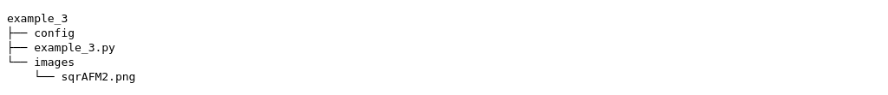
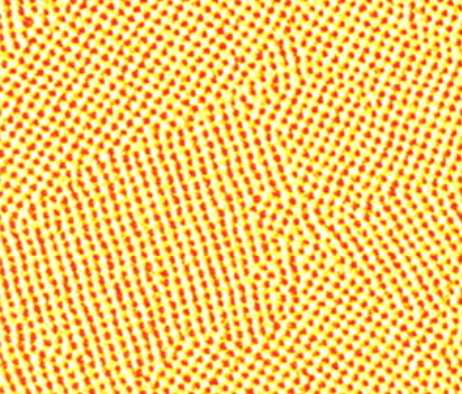
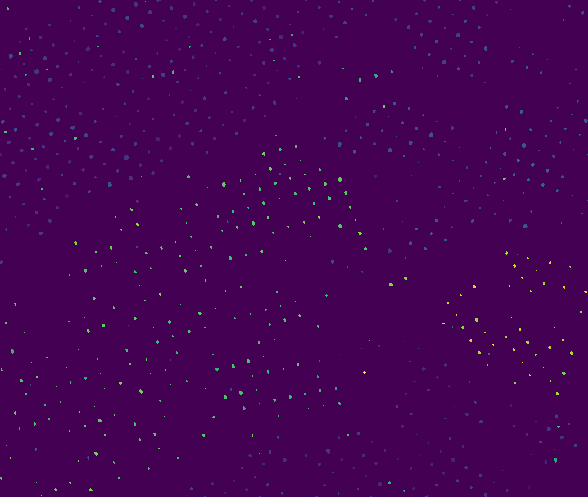
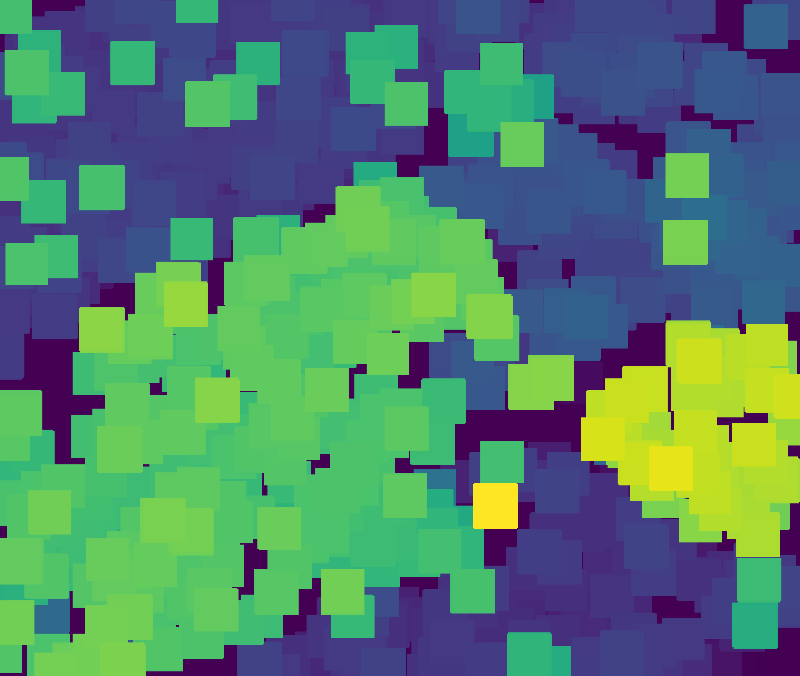
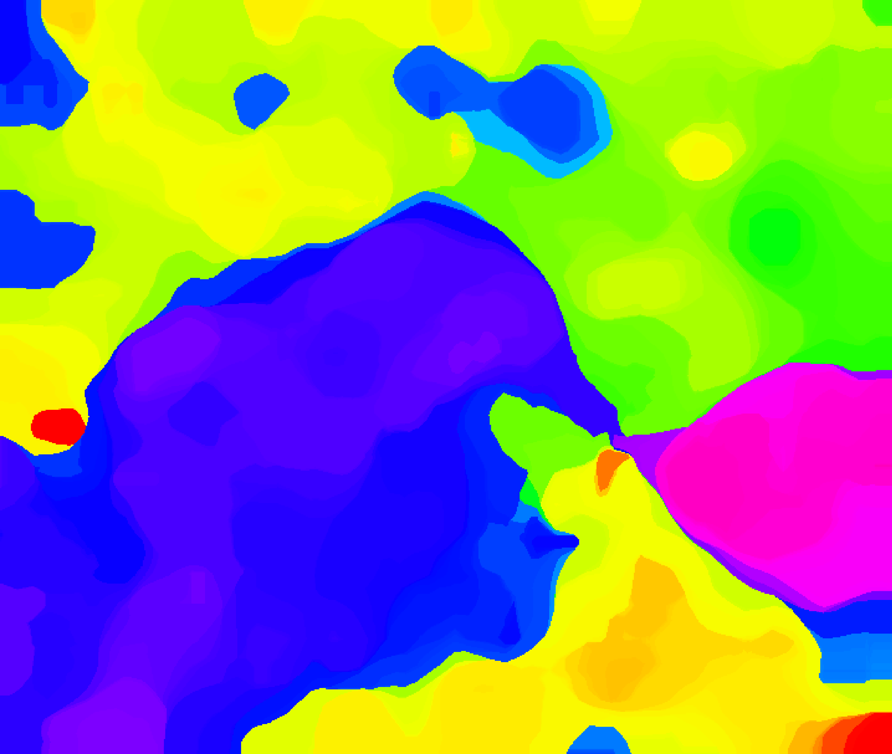
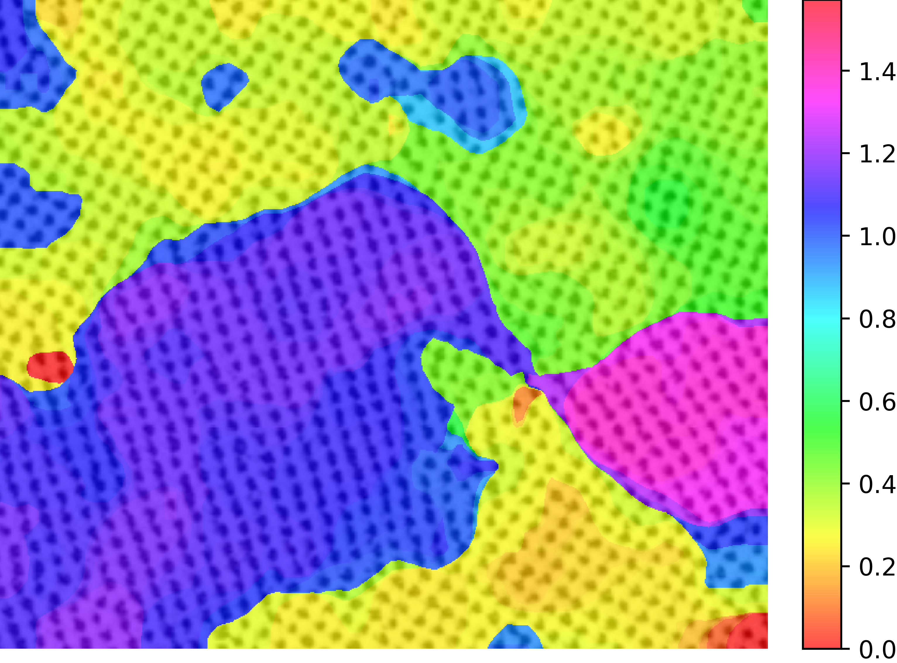

.. Contains the third example.
.. _example_3:

Example 3 - Local Pattern Orientation
=====================================

This example goes through the process of computing the local pattern orientation from ref. REFTINO for self-assembly microscopy images using :code:`shapelets.self_assembly`. 

The files for this example can be found in "shapelets/examples/example_3".

**NOTE** - this example can be run in two different ways, and both methods are presented here.
* (1) the configuration-file based user interface (config method)
* (2) importing neccessary :code:`shapelets` submodules in a script-based format (scripting method)

Technical overview
------------------

Local pattern orientation is concerned with the relative orientation of nanostructure along grain boundaries and in between grains.

The method to compute local pattern orientation from ref. REFTINO contains three (3) main steps:

* (1) **Masking**: Masking is performed for well-defined features using a specific response threshold. This threshold is found via an interative scheme. Only the orientation values from these well-defined features included in the mask are used.
* (2) **Dilation**: Dilation (via morphological greyscale dilation) is used to expand the orientation from well-defined features and ultimately define orientation in void space (between well-defined features and over orientational boundaries). The dilation kernel size is chosen to be 2:math:`\lambda`, where :math:`\lambda` is the characteristic wavelength of the pattern and is also the approximate distance between well-defined features. 
* (3) **Blending**: Blending (or smoothing) is performed via a median filter to allow for effective transition in orientations between neighbouring well-defined features and across orientational boundaries. The blending kernel size is chosen to be 4:math:`\lambda` so that the orientation is averaged from two layers of surrounding features.

**NOTE** - dilation and blending are achieved through the :code:`scipy.ndimage.grey_dilation` and :code:`scipy.ndimage.median_filter` available from `scipy.ndimage <https://docs.scipy.org/doc/scipy/reference/ndimage.html>`_.

Directory overview
------------------

The directory in "shapelets/examples/example_3" should contain the following.

* **config** contains the configuration file to run example 3 via config method
* **example_3.py** contains the script to run example 3 via scripting method
* **images/** contains the image used in this example, shown below

Method parameters
-----------------

The parameters for the local pattern orientation method are outlined below.

Note these parameters are the same if using the configuration-file based method (config) or the scripting method (example_1.py). 

These parameters are explained below, note that *default* refers to default behaviour if the parameter is excluded.

* **pattern_order**

	* stripe - used when image contains a stripe self-assembly pattern
	* square - used when image contains a square self-assembly pattern
	* hexagonal - used when image contains a hexagonal self-assembly pattern
	* default = not applicable

**Note**

* The "pattern_order" parameter does not have a default value; failure to provide a value will throw an error
* The image you intend to analyze **should not** contain a mix of pattern orders; i.e., it should only contain one pattern order throughout the entire image

Config method - config setup
----------------------------

The *general* section of the configuration file contains two parameters. 

	[general]
	image_name = sqrAFM2.png
	method = orientation

The "image_name" and "method" parameters are required.

Here the "method" parameter is chosen to be "response_distance" to indicate computation of local pattern orientation from ref. REFTINO.  

The *orientation* section of the configuration file contains one parameter.

	[orientation]
	pattern_order = square

These parameters are explained in detail in the above section "Method parameters".

Config method - running config
------------------------------

This config file is setup to compute the local pattern orientation for images/sqrAFM2.png.

Navigate your terminal to "shapelets/examples/example_3". 

When you are ready, type :code:`shapelets config`.

Depending on your computer resources, the convergence scheme may take a couple of minutes.

The outputs (shown below) will then be available in "shapelets/examples/example_3/output" containing the mask, dilated feature orientation, smoothed orientation result, and the smoothed orientation result superimposed onto the original pattern.

Scripting method - example_3.py breakdown
-----------------------------------------

This method is presented as an alternative to the configuration-file based user interface (config method).

**example_3.py** is pre-configured and requires **no additional modifications**.

The code breakdown is as follows,

* Section 1: importing modules - imports the necessary modules from the :code:`shapelets` package.
* Section 2: parameters - this contains the required parameters needed for the methods required to compute the response distance method (see above section "Method parameters" for details)
* Section 3: code - this contains the code to compute the local pattern orientation which involves the following steps:

	* 3.1: image and output directory handling
	* 3.2: get the characteristic wavelength of the pattern
	* 3.3: get the convolutional response 
	* 3.4: compute the local pattern orientation
	* 3.5: processing and saving the results to the **output/** directory 

Scripting method - executing example_3.py
-----------------------------------------

Navigate your terminal to "shapelets/examples/example_3". 

When you are ready, type :code:`python3 -m example_3` (for MAC OS and LINUX users).

For WINDOWS users, please replace 'python3' with 'python'.

The output will be available in "shapelets/examples/example_3/output".

For an example of the output expected, see the config method section above "Config method - running config".
