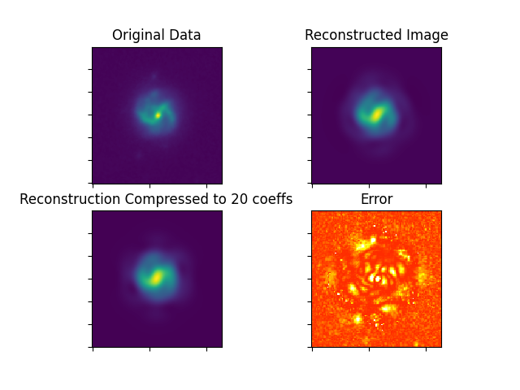

.. Contains the first example astronomical image example.
.. _example_4:

Example 4 - Astronomical Image Decomposition
============================================

This example goes through the process of computing shapelet representations for a collection of galaxies using :code:`shapelets.astronomy`.

The files for this example can be found in "shapelets/examples/example_4".

**NOTE** - this example can be run in two different ways, and both methods are presented here.
* (1) the configuration-file based user interface (config method)
* (2) importing neccessary :code:`shapelets` submodules in a script-based format (scripting method)

Technical overview
------------------

The astronomical intensity/pixel data collected from the Hubble telecsope is is stored in a .fits file.
Flexible Image Transport System (or FITS) (`Allen and Wells (2005) <https://fits.gsfc.nasa.gov/rfc4047.txt>`_) were designed to standarize the exchange of astronomical image data between observatories.
FITS provides a method to transport arrays and tables of data alongside its related metadata. 

These intesities represent localized celestial objects (such as galaxies) that once seperated from the original image, can be decomposed into a linear combination of shapelet functions. The method contains three (3) main steps:

* (1) **Source Extractor**: using Source Extractor (`Bertin and Arnouts (1996) <https://ui.adsabs.harvard.edu/abs/1996A&AS..117..393B>`_), subdomains containing localized intensities are selected from the intensity data, and catergorized as galaxies or stars by pixel cluster size.
* (2) **Shapelet Projection**: the subdomain is projected onto a collection of 2D cartesian shapelets using a beta and centroid initially estimated by Source Extracter and n such that :math:`n_1 + n_2 <= n_max`.
* (3) **Shapelet Parameter Optimization**: using formulae from (`Refregier (2003) <https://doi.org/10.1046/j.1365-8711.2003.05901.x>`_), the object's centroid and characteristic size are estimated from the decomposed shapelet coefficients and used as an updated beta and centroid for more optimized decomposition.
* (4) **Shapelet State Compression**: the shapelet coefficients are truncated to a limited number of coefficients, removing insignificant contributions to the shapelet representation. This truncated representation is then used to reconstruct the original image and its respective error is calculated.

Steps 2-3 are repeated for all galaxies identified by Source Extractor

Directory overview
------------------

The directory in "shapelets/examples/example_4" should contain the following.

* **config** contains the configuration file to run example 4 via config method
* **example_4.py** contains the script to run example 4 via scripting method
* **images/** contains the fits used in this example, show below is the data with a linear colour scale scale and an image scaled from the mean and standard deviation

.. image:: ../images/galaxies_linear.jpg
	:width: 45%
	:align: left
	:alt: image of galaxies as seen by normal telecsope

.. image:: ../images/galaxies_std.jpg
	:width: 45%
	:align: right
	:alt: image of galaxies normalized to the mean of the data

Method parameters
-----------------

The parameters for the galaxy decomposition are outlined below.

Note these parameters are the same if using the configuration-file based method (config) or the scripting method (example_4.py). 

These parameters are explained below, note that *default* refers to default behaviour if the parameter is excluded.

* **fits_path** 

	* str - string, path to the .fits data file containing the astronomical data

* **shapelet_order** 

	* int - integer, maximum shapelet order to calculate coefficients :math:`n_1 + n_2 <= n_max`
	* default = 10

* **compression_order** 

	* int - integer,  number of shapelet coefficients to use for final image reconstruction
	* default = 25

**NOTE**
* You may only exclude parameters that have defaults

Config method - config setup
----------------------------

The *general* section of the configuration file contains two parameters. 

	[general] 
	method = galaxy_decompose

The "method" parameter is required.

The *galaxy_decompose* section of the configuration file contains three parameters. 

	[galaxy_decompose] 
	fits_path = galaxies.fits 
	shapelet_order = default 
	compression_order = 20 

The "fits_path" parameter is required.
These parameters are explained in detail in the above section "Method parameters".

Config method - running config
------------------------------

This config file is setup to perform galaxy decomposition for images/galaxies.fits.

Navigate your terminal to "shapelets/examples/example_4". 

When you are ready, type :code:`shapelets config`.

The output (first 2 images shown below) will be available in "shapelets/examples/example_4/output" 

1. galaxies_map.png shows ellipses enclosing locations of galaxies superimposed on the linear and mean normalized image
2. the remaining images contains information about the first decomposed galaxy, including:
	a) the subdomain of the original image containing the galaxy
	b) a reconstruction of the galaxy using the all calculated coefficients and a compressed set coefficients
	c) the compressed reconstruction's relative error.

Scripting method - example_4.py breakdown
-----------------------------------------

This method is presented as an alternative to the configuration-file based user interface (config method).

**example_4.py** is pre-configured and requires **no additional modifications**.

The code breakdown is as follows,

* Section 1: importing modules - imports the necessary modules from the :code:`shapelets` package
* Section 2: parameters - this contains the required parameters needed for the methods required to compute the response distance method (see above section "Method parameters" for details)
* Section 3: code - this contains the code to compute the response distance method which involves the following steps:

	* 3.1: loading .fits data and output directory handling
	* 3.2: identifying areas in the image that contain decomposable galaxies
	* 3.3: starting with the biggest galaxy, decomposes subdomain into a collection of shapelet coefficients

Scripting method - executing example_4.py
-----------------------------------------

Navigate your terminal to "shapelets/examples/example_4". 

When you are ready, type :code:`python3 -m example_4` (for MAC OS and LINUX users).

For WINDOWS users, please replace 'python3' with 'python'.

The output will be available in "shapelets/examples/example_4/output".

For an example of the output expected, see the config method section above "Config method - running config".
