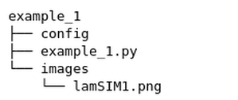
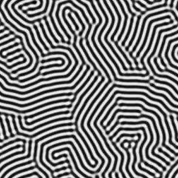
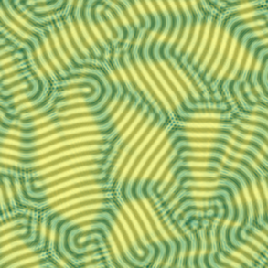

# Example 1 - Response Distance

See [here](https://github.com/uw-comphys/shapelets/tree/main/examples/example_1) for example files and code. 

This example demonstrates the response distance method ([R. Suderman (2015)](https://doi.org/10.1103/PhysRevE.91.033307)) for self-assembly microscopy imaging using the ``shapelets.self_assembly`` submodule.

This example can be run in two different ways:
* (1) text-based configuration files (shown here), and 
* (2) programmatically via script-based Python programming (`example_1.py`)

This example will go through the text-based configuration file approach (1). For users comfortable with Python programming, the example_1.py file is setup to run the same analysis described below. The outputs will appear in the same directory.

## Overview

The response distance ([R. Suderman (2015)](https://doi.org/10.1103/PhysRevE.91.033307)) is calculated as:

$$ d_{i, j} = \min \| \vec{R} - \vec{r_{i,j}} \|_2 $$

where $\vec{r_{i,j}}$ denotes the given response vector at pixel location $\{i, j\}$ and $\vec{R}$ is the reference set (or subdomain) of response vectors.

The example [directory](https://github.com/uw-comphys/shapelets/tree/main/examples/example_1) should contain the following.

where **config** is the text-based configuration file, **example_1.py** is the Python script file, and **images/** holds the simulated stripe self-assembled nanostructure image ([R. Suderman (2015)](https://doi.org/10.1103/PhysRevE.91.033307)) for analysis.

## Configuration File Method

### Setup

The configuration file provided in the example [directory](https://github.com/uw-comphys/shapelets/tree/main/examples/example_1) contains the following information:

	[general]
	image_name = lamSIM1.png
	method = response_distance

	[response_distance]
	shapelet_order = default
	num_clusters = 20
	ux = [50, 80]
	uy = [150, 180]

where **image_name** and **method** are required parameters that specify the image filename and method used for analysis.

The method outlined in the configuration file will also have its own header with specific parameters. The **response_distance** method may contain up to four parameters. Certain parameters also have defaults, these can be excluded from the configuration file if desired.

**shapelet_order** `int`

* The maximum shapelet order ($m'$) used for convolution operations, i.e. $m \in [1, m']$ shapelets are used 
* Default value (via keyword *default* as shown above) allows $m'$ to be determined by the higher-order shapelet algorithm ([M.P. Tino (2024)](http://dx.doi.org/10.1088/1361-6528/ad1df4))

**num_clusters** `int`

* The number of clusters for k-means clustering. Note using 0 is acceptable and will use all response vectors in the reference region ([R. Suderman (2015)](https://doi.org/10.1103/PhysRevE.91.033307))
* Default value is 20 clusters as determined by a distortion analysis ([T. Akdeniz (2018)](https://doi.org/10.1088/1361-6528/aaf353))

**ux** `list`

* The lower and upper x-coordinates (respectively) of the reference region 
* Default requires user to select x-bounds during runtime, see [here](#selecting-subdomain-bounds-during-runtime) for instructions

**uy** `list`

* The lower and upper y-coordinates (respectively) of the reference region 
* Default requires user to select y-bounds during runtime, see [here](#selecting-subdomain-bounds-during-runtime) for instructions

### Run Example

Please ensure that `shapelets` is properly installed before proceeding.
See [here](https://uw-comphys.github.io/shapelets/shapelets/docs/installation_guide.html) for installation instructions.

Navigate your terminal to "shapelets/examples/example_1". When you are ready, execute ``shapelets config`` in the command line.

The output (shown below) will be available in "shapelets/examples/example_1/output" containing the response distance scalar field (left) as well as this field superimposed onto the original pattern (right).

## Selecting subdomain bounds during runtime

If you are computing the response distance method for the first time on a new image, you have the option to omit the **ux** and **uy** parameters so that you can choose the reference region during runtime. 

**Selecting bounds during runtime**

After executing example 1, either via ``shapelets config`` in the command line (Configuration File Method) or programmatically through **example_1.py**, you will be prompted to select four (4) points that represent the corners/bounds of the reference subdomain. At this point, you can use

* ``a`` to select a corner (bound) in no particular order, 
* ``backspace/delete`` to remove the most recently selected corner, and 
* ``enter`` when you have finished selecting 4 points/corners 

**Additional Tips**

* You may use the **magnifying glass** (bottom left) to zoom in on a specific region
* You may use the **left arrow** (bottom left) to return to original zoom
* Failure to choose 4 points/corners (i.e., choosing less or more than 4) will restart the process automatically
* Please choose a region of the pattern that contains zero observable defects in order to maximize the response distance results