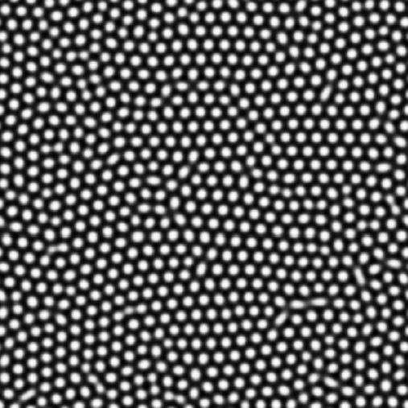

# Example 2 - Defect Identification

See [here](https://github.com/uw-comphys/shapelets/tree/main/examples/example_2) for files and code related to this example. 

This example demonstrates the defect identification method ([M.P. Tino (2024)](http://dx.doi.org/10.1088/1361-6528/ad1df4)) implemented in ``shapelets.self_assembly.quant.defectid`` for the simulated hexagonal self-assembled nanostructure image ([R. Suderman (2015)](https://doi.org/10.1103/PhysRevE.91.033307)) shown below.

## Overview

The defect identification method ([M.P. Tino (2024)](http://dx.doi.org/10.1088/1361-6528/ad1df4)) is a modification of the response distance method ([R. Suderman (2015)](https://doi.org/10.1103/PhysRevE.91.033307)), whereby the user is required to manually select clusters associated with defects or defect structures, and the defect response distance is computed for each response vector in each cluster. 

The defect response distance is similar to the response distance, but the reference subdomain is the centroid response vector of each cluster (and not a set of reference response vectors). For example, for a given cluster $C$ with centroid $C_c$, the defect response distance for response vector $c_i$ belonging to cluster $C$ with centroid response vector $C_c$ is computed as:

$$ d_i = \| C_c - c_i \|_2 $$

The key observation is that cluster response vectors with larger defect response distances are more "defect-like", allowing use of the defect response distance as a quantitative measure of "defect intensity" ([M.P. Tino (2024)](http://dx.doi.org/10.1088/1361-6528/ad1df4)).

## Configuration File

### Setup

The example [config](https://github.com/uw-comphys/shapelets/tree/main/examples/example_2) contains the following:

	[general]
	image_name = hexSIM1.png
	method = identify_defects

	[identify_defects]
	pattern_order = hexagonal

where **image_name** and **method** are required parameters that specify the image filename and method used for analysis, respectively.

The **identify_defects** method requires one parameter.

**pattern_order** `str` (required)

* The pattern order (symmetry) observed in the image. 
* Example values: `stripe`, `square`, `hexagonal`

### Run Example

Ensure `shapelets` is installed before proceeding.
See [here](https://uw-comphys.github.io/shapelets/shapelets/docs/installation_guide.html) for installation instructions.

This example assumes the working directory has a sub-directory ``analysis`` containing the necessary files: ``analysis/config`` and ``analysis/images/hexSIM1.png``. 

To run the example, execute ``shapelets-run ./analysis/config`` in the command line.

During runtime you will be prompted to manually select the clusters associated with defects or defect structures. Please follow these instructions and use

* ``a`` to select a cluster (in no particular order), 
* ``backspace/delete`` to remove the most recently selected cluster, and 
* ``enter`` when you have finished selecting defect clusters

**Additional Tips**

* You may use the **magnifying glass** (bottom left) to zoom in on a specific region
* You may use the **left arrow** (bottom left) to return to original zoom

The output (shown below) will be available in ``./analysis/output`` containing the location of each cluster (top left), radar chart of centroid response vectors (top right), the defect response distance scalar field (bottom left), and this field superimposed onto the original pattern (bottom right). In this example, clusters 2, 5, and 8 were chosen by the user as defect clusters. 

## Additional Notes

For users who do not wish to use configuration files and would prefer to interact with shapelets via standard python programming, please see the ``example_2.py`` script [here](https://github.com/uw-comphys/shapelets/tree/main/examples/example_2).
You can use this script as a template to conduct your own analyses.