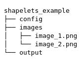
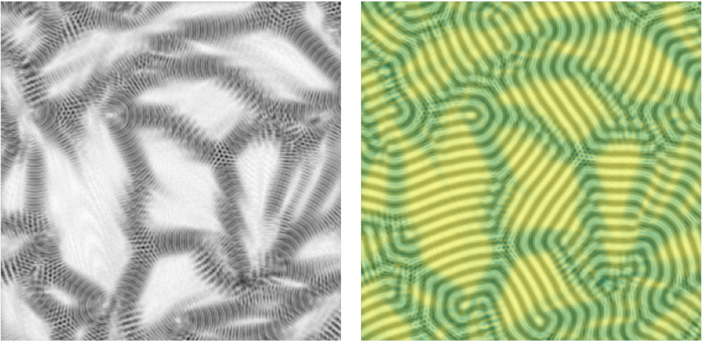

# Summary

`Shapelets` is a Python-based software package that implements several shapelet functions [@Refregier2003] and some of their significant applications in science and astronomy. Shapelet functions are a complete and orthogonal set of localized basis functions with mathematical properties convenient for manipulation and analysis of images from a broad range of applications. Over the past few decades, there have been several different shapelet function formulations developed and applied in the areas of astronomy/astrophysics [@Refregier2003; @Massey2005; @Lentati2015; @Birrer2015; @Desvignes2016; @Berge2019], self-assembly nanomaterials [@Suderman2015; @Akdeniz2018; @Tino2024], computational neuroscience [@Victor2006; @Sharpee2009], and medical imaging [@Weissman2004].

The `shapelets` software package provides reference implementations and documentation for four different shapelet formulations: cartesian [@Refregier2003], polar [@Massey2005], orthonormal polar with constant radial scale [@Akdeniz2018], and exponential [@Berge2019]. Additionally, the `shapelets` package provides reference implementations of several applications of shapelet functions in astronomy (galactic image decomposition and reconstruction [@Refregier2003; @Massey2005]) and self-assembly (quantification of nanostructure order [@Suderman2015; @Akdeniz2018; @Tino2024]). The coding style of `shapelets` is based on that of [`scipy.special`](https://docs.scipy.org/doc/scipy/reference/special.html) [@scipy].

For ease of use, `shapelets` also provides a text configuration-based user interface and Python [entry points](https://packaging.python.org/en/latest/specifications/entry-points/) (custom terminal commands) to improve accessibility for a broad range of potential users in science and engineering, including those without a strong Python programming background. For example, the configuration-file based interface can be invoked via `shapelets config`, and running the unit tests associated with the package can be invoked via `shapelets-test`.

Lastly, the `shapelets` package includes a set of detailed examples which demonstrate usage of the software through both the text configuration-based and programmatic interfaces. These examples include both astronomy and self-assembly applications, providing users with a basis for developing their own applications for the package and shapelet functions in general.

# Statement of Need

Shapelets are a class of complete localized orthogonal basis functions with a broad range of applications in image processing and reconstruction [@Refregier2003; @Massey2005; @Suderman2015; @Akdeniz2018; @Tino2024]. Despite their increasingly widespread use, there currently is no single software package that is both broadly accessible (e.g. written in Python or other high-level programming language) and implements several useful applications. Currently, there exists an open source astronomy-focused [shapelet software package](https://www.astro.dur.ac.uk/~rjm/shapelets/code/index.php) [@Massey2005], however, it is written in the Interactive Data Language (IDL) programming language which is not widely used in the science and engineering communities. Furthermore, this package has not been updated in over a decade. Given the increasingly broad usage of shapelets in areas outside of astronomy/astrophysics, an open source Python-based shapelets software package would provide access to these functions and their applications for a larger community, along with facilitating open source scientific software development through the existence of a centralized software package that allows for contribution and collaboration.

Similarly, quantification of structure/property relationships for nanomaterials is critical for continued progress in materials research [@Abukhdeir2016]. This is especially true for nanomaterials with complex spatially-varying patterns, such as self-assembly materials [@Abukhdeir2016]. There are other methods to quantify nanostructure order, such as bond-orientational order analysis [@Brock1992], but these methods do not provide pixel-scale information and do not have readily available open source software implementations. Methods to quantify nanostructure order, such as those implemented in the `shapelets` package, would significantly advance (nano)materials research and provide researchers with accessible tools to quantify order for their own material images.

The overall aim of the `shapelets` package is to address these needs through (1) providing well-documented and accessible code for researchers interested in using these shapelet functions and existing applications and (2) promoting open source collaboration for future development of shapelet-related research.

# Features

The table below summarizes the different shapelet functions implemented in the `shapelets` package.

| Shapelet Functions     | Description                                                                                                                                  |
| ---------------------- | ------------------------------------------------------------------------------------------------------------------------------------------------------- |
| Cartesian     | Cartesian shapelets [@Refregier2003] via `shapelets.functions.cartesian1D`, `shapelets.functions.cartesian2D`            |
| Polar             | Polar shapelets [@Massey2005] via `shapelets.functions.polar2D`                                                                       |
| Orthonormal polar  | Orthonormal polar shapelets with constant radial scale [@Akdeniz2018] via  `shapelets.functions.orthonormalpolar2D`                  |
| Exponential   | Exponential shapelets [@Berge2019] via `shapelets.functions.exponential1D`, `shapelets.functions.exponential2D`          |

The table below summarizes the specific shapelet applications implemented in this package.

| Shapelet Applications    		  | Description                                                                                                                       |
| ------------------------------- | ---------------------------------------------------------------------------------------------------------------------------------------------------- |
| Galaxy decomposition            | Galactic image decomposition & reconstruction [@Refregier2003] via `shapelets.astronomy.decompose_galaxies`                                                |
| Response distance         | Response distance method for self-assembly microscopy imaging [@Suderman2015] via `shapelets.self_assembly.rdistance` |
| Orientation                     | Local pattern orientation for self-assembly microscopy imaging [@Tino2024] via `shapelets.self_assembly.orientation`                    |
| Defect identification     | Defect identification method for self-assembly microscopy imaging [@Tino2024] via `shapelets.self_assembly.defectid`                    |

More information, such as installation instructions and application-specific examples can be found on the package [website](https://uw-comphys.github.io/shapelets).

# User Interface Methods

The `shapelets` python package can be used in two different ways: text-based configuration files and directly via interactive or script-based Python programming.

## Understanding the Configuration File Method

The text-based user interface for `shapelets` is centered around configuration files and the CLI (command line interface). Each use of the shapelets package (via configuration files) should have a main directory (here called "shapelets_example") with standard sub-directories and required files as shown in \autoref{fig:sample_dir}.

{ width=40% }

The main (shapelets_example) directory contains the main configuration file (e.g., `config`) which is a plain-text file specifying specific parameters or methods to be used. Acceptable parameters and options for the configuration file can be found throughout the examples, depending on the shapelet-based method being applied.

The `images/` subdirectory contains the data for image analysis and must be present. The `output/` subdirectory is created by the `shapelets` software and contains output data/images based on the analysis directed in the `config`.

Alternatively, the Python-based software interface of the `shapelets` package can be used either interactively or via scripting through standard import of either shapelet function implementations and/or application submodules.

# Examples of Usage

For each example included in the package, implementations using both the configuration file and programming-based interfaces are demonstrated. Several detailed image processing examples were developed that demonstrate the use and capabilities of the shapelets package for both astronomy and self-assembly related applications. See the package [website](https://uw-comphys.github.io/shapelets) for more example details and documentation, and the package [code](https://github.com/uw-comphys/shapelets) for related files.

Examples 1-3 demonstrate use of the `shapelets.self_assembly` module, with specific applications for the response distance method [@Suderman2015], defect identification method [@Tino2024], and local pattern orientation [@Tino2024] (respectively).
Example 4 demonstrates use of the `shapelets.astronomy` submodule for the decomposition and reconstruction of galactic images [@Refregier2003]. All examples have instructions to use the `shapelets` package via configuration files or importing relevant submodules in pre-configured `.py` files (scripting). Examples 1, 2, and 4 are shown here.

## Example 1 - Response Distance Method

Example 1 demonstrates use of the `shapelets.self_assembly` submodule to compute the response distance method [@Suderman2015]. This example will use a simulated stripe self-assembly microscopy image [@Suderman2015], shown in \autoref{fig:lamSIM1}.

![Simulated stripe self-assembly nanostructure [@Suderman2015].\label{fig:lamSIM1}](images/lamSIM1.png){ width=40% }

### Response Distance

The response distance [@Suderman2015] is computed as $$d_{i, j} = \min \| \vec{R} - \vec{r_{i,j}} \|_2$$ where $\vec{r_{i,j}}$ denotes the given response vector at pixel location $\{i, j\}$ and $\vec{R}$ is the reference set of response vectors.

### Configuration file Method

The configuration file (`config`) contains the following information,

	[general]
	image_name = lamSIM1.png
	method = response_distance

	[response_distance]
	shapelet_order = default
	num_clusters = 20
	ux = [50, 80]
	uy = [150, 180]

where

* *shapelet_order* details the maximum shapelet order ($m'$) to use during convolution (i.e., $m = [1, m']$) [@Tino2024],
* *num_clusters* details the number of clusters required for k-means clustering [@Wu2012], and
* [*ux*, *uy*] detail the coordinates of the user-defined reference subdomain required for the response distance method [@Suderman2015].

*Note - the shapelet_order parameter in this example is based on the definition from [Akdeniz et al. (2018)](https://doi.org/10.1088/1361-6528/aaf353). This is different from the definition used in `shapelet.astronomy` methods/examples.*

Possible values for each parameter, including default values where applicable, are available in the example's documentation on the package [website](https://uw-comphys.github.io/shapelets).

To run this example, navigate the terminal directory to "shapelets/examples/example_1". Then, type `shapelets config` into the command line. The outputs, shown in \autoref{fig:lamSIM1_RD}, will be available in "shapelets/examples/example_1/output", containing the following two images corresponding to the response distance scalar field and the superimposed field on the original image.

{ width=80% }

**Note** - typically, you may not know the **ux** and **uy** parameters for the image when computing the response distance for the first time. If this is the case, please see the section "Selecting subdomain bounds during runtime" in the Example 1 documentation.

### Scripting Method

For users wishing to interact with the `shapelets` package in a more traditional format, the `example_1.py` file is setup to obtain the same outputs as seen above without any code modifications needed.

After executing `example_1.py`, the outputs (\autoref{fig:lamSIM1_RD}) will be available in "shapelets/examples/example_1/output".

## Example 2 - Defect Identification Method

Example 2 demonstrates use of the `shapelets.self_assembly` submodule to compute the defect identification method [@Tino2024]. This example will use a simulated hexagonal self-assembly microscopy image [@Suderman2015], shown in \autoref{fig:hexSIM1}.

![Simulated hexagonal self-assembly nanostructure [@Suderman2015].\label{fig:hexSIM1}](images/hexSIM1.png){ width=40% }

### Defect Identification Method

The defect identification method [@Tino2024] is a modification of the response distance method [@Suderman2015].

The user is required to manually select the clusters associated with defects or defect structures, and the *defect response distance* is computed for each cluster.

The *defect response distance* is similar to the response distance, but the reference subdomain is the centroid response vector of each cluster (and not a set of reference response vectors).

I.e., for a given cluster $C$ with centroid $C_c$, the defect response distance is computed as $$d_i = \| C_c - c_i \|_2$$ where $c_i$ is a cluster response vector belonging to cluster $C$ and is computed for all response vectors in *each* cluster.

### Configuration file Method

The configuration file (`config`) contains the following information,

	[general]
	image_name = hexSIM1.png
	method = identify_defects

	[identify_defects]
	pattern_order = hexagonal
	num_clusters = 10

where

* *pattern_order* details the dominant pattern symmetry in the image, and
* *num_clusters* details the number of clusters desired for k-means clustering [@Wu2012].

Possible values for each parameter, including default values where applicable, are available in the example's documentation on the package [website](https://uw-comphys.github.io/shapelets).

To run this example, navigate the terminal directory to "shapelets/examples/example_2". Then, type `shapelets config` into the command line.

You will be required to select the clusters associated with defects or defect structures during runtime. Details for this specific process can be found in the example's documentation on the package [website](https://uw-comphys.github.io/shapelets).

The outputs, shown in \autoref{fig:hexSIM1_defectid}, will be available in "shapelets/examples/example_2/output", containing the following four images corresponding to (1) the locations of each cluster through the image, (2) radar chart representations of the centroid response vectors from k-means clustering [@Wu2012], (3) the defect response distance scalar field, and (4) this scalar field superimposed onto the original image.

![Defect identification method [@Tino2024] applied to \autoref{fig:hexSIM1}.\label{fig:hexSIM1_defectid}](images/hexSIM1_defectid.png){ width=80% }

### Scripting Method

For users wishing to interact with the `shapelets` package in a more traditional format, the `example_2.py` file is setup to obtain the same outputs as seen above without any code modifications needed.

After executing `example_2.py`, the outputs (\autoref{fig:hexSIM1_defectid}) will be available in "shapelets/examples/example_2/output".

## Example 4 - Galactic Image Decomposition & Reconstruction

Example 4 demonstrates use of the `shapelets.astronomy` submodule to decompose a collection of galaxies into a linear combination of shapelet functions. This example will use a subset of galaxies from the Hubble Deep Field North [@Refregier2003], shown in \autoref{fig:galaxies}.

{ width=80% }

### Galaxy Decomposition

The galaxy decomposition method is based on the properties of cartesian shapelet functions [@Refregier2003], where any (image) function can be represented (or approximated) as a sum of scaled shapelet functions.

In this example, the astronomical intensity/pixel data is stored in a Flexible Image Transport System (FITS) file, designed to standarize the exchange of astronomical image data between observatories.

These intesities represent localized celestial objects (such as galaxies) that, once separated from the surrounding image, are decomposed into a linear combination of shapelet functions.

### Configuration file Method

The configuration file (`config`) contains the following information,

	[general]
	fits_name = galaxies.fits
	method = galaxy_decompose

	[galaxy_decompose]
	shapelet_order = default
	compression_order = 20

where

* *shapelet_order* details the maximum order of shapelets used in the decomposition, and
* *compression_order* details the number of significant shapelet coefficients used in the final reconstruction.

*Note - the shapelet_order parameter in this example is based on the definition from [Refregier et al. (2003)](https://doi.org/10.1046/j.1365-8711.2003.05901.x). This is different from the definition used in `shapelet.self_assembly` methods/examples.*

Possible values for each parameter, including default values where applicable, are available in the example's documentation on the package [website](https://uw-comphys.github.io/shapelets).

To run this example, navigate the terminal directory to "shapelets/examples/example_4". Then, type `shapelets config` into the command line.

The outputs, shown in \autoref{fig:galaxies_output}, will be available in "shapelets/examples/example_4/output", containing two types of images corresponding to (1) the locations of galaxies highlighted on the linear and mean normalized image, and (2) images containing information about each decomposed galaxy, including: the subdomain of the original image, reconstructions of the galaxy using all calculated coefficients and a compressed set of coefficients, and the compressed reconstruction's relative error.

{ width=100% }

### Scripting Method

For users wishing to interact with the `shapelets` package in a more traditional format, the `example_4.py` file is setup to obtain the same outputs as seen above without any code modifications needed.

After executing `example_4.py`, the outputs (\autoref{fig:galaxies_output}) will be available in "shapelets/examples/example_4/output".

# Acknowledgements

This research was supported by the Natural Sciences and Engineering Research Council of Canada (NSERC) and the Digital Research Alliance of Canada.

# References
